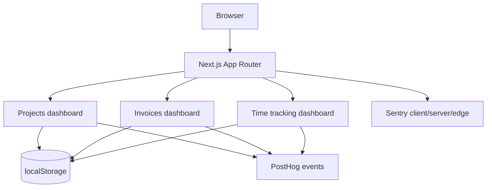

# Powerhouse Freelance OS

Powerhouse is a Next.js App Router workspace for managing freelance projects, invoices, and tracked time. The current application uses mock data persisted in the browser so the workflows are usable without a backend.

## Quick Start

Requirements: Node.js 20+ and npm.

```bash
npm install
npm run dev
```

Open [http://localhost:3000](http://localhost:3000).

Available routes: `/projects`, `/invoices`, and `/time-tracking`.

## Architecture



Route `page.tsx` files provide metadata and delegate interactive work to client dashboard components. Shadcn UI primitives live under `components/ui`, shared class merging is in `lib/utils.ts`, and business rules are isolated in `lib/business.ts` for unit testing.

## Data Models

| Model | Fields | Storage key |
| --- | --- | --- |
| Project | `id`, `name`, `client`, `status`, `progress`, `budget`, `spent`, `due`, `members` | `powerhouse-projects` |
| Invoice | `id`, `client`, `project`, `amount`, `issued`, `due`, `paid` | `powerhouse-invoices` |
| Time entry | `id`, `project`, `note`, `date`, `minutes` | `powerhouse-time-entries` |

These are mock persistence boundaries. Replace the `localStorage` effects with server actions or API calls when introducing authenticated multi-user storage.

## API References

There is no application API yet. The external integrations are [Next.js App Router](https://nextjs.org/docs/app), [Tailwind CSS](https://tailwindcss.com/docs), [Shadcn UI](https://ui.shadcn.com/docs), [PostHog JavaScript](https://posthog.com/docs/libraries/js), and [Sentry Next.js](https://docs.sentry.io/platforms/javascript/guides/nextjs/).

PostHog events are sent through `lib/analytics.ts`. Sentry is initialized in `instrumentation-client.ts`, `sentry.server.config.ts`, and `sentry.edge.config.ts`.

## Testing

```bash
npm run lint
npm test
npm run test:e2e
npm run build
```

Jest and React Testing Library cover business rules and dashboard rendering. Playwright covers route loading and opening the project creation dialog. Install the browser once before local E2E runs:

```bash
npx playwright install chromium
```

## Deployment

Import the repository into Vercel, configure the environment variables below, and use `npm run build` as the production build command. After deployment, verify all three application routes.

| Variable | Scope | Purpose |
| --- | --- | --- |
| `NEXT_PUBLIC_POSTHOG_KEY` | Client | Enables PostHog browser events |
| `NEXT_PUBLIC_POSTHOG_HOST` | Client | Optional PostHog host override |
| `NEXT_PUBLIC_SENTRY_DSN` | Client | Enables browser Sentry |
| `SENTRY_DSN` | Server/Edge | Enables server and Edge Sentry |

Never commit secret keys. Preview deployments can use separate analytics projects and Sentry environments.

## CI

GitHub Actions runs on pushes and pull requests to `main`. It uses `npm ci`, then runs lint, Jest, Playwright Chromium checks, and the production build. The build step is the deployment readiness check.
